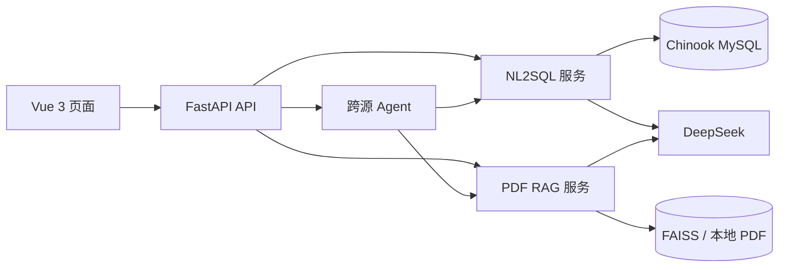
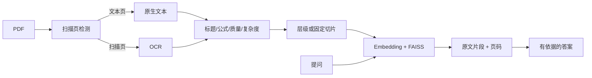
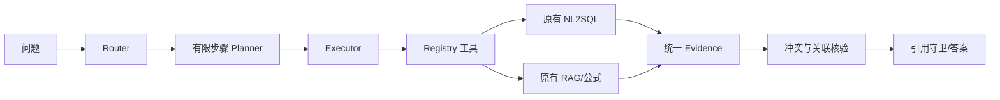
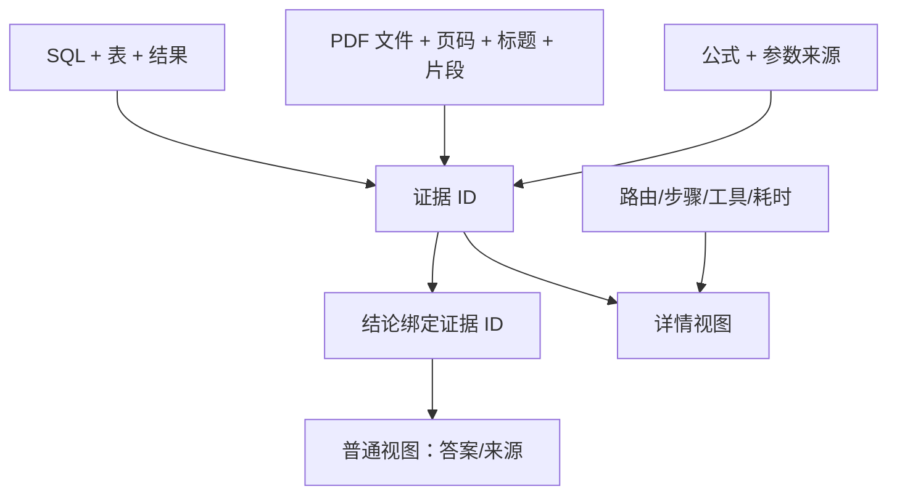

# 架构图（比赛答辩）

## 总体架构

```mermaid
flowchart LR
 U[Vue 3 页面] --> A[FastAPI API]
 A --> D[NL2SQL 服务]
 A --> R[PDF RAG 服务]
 A --> G[跨源 Agent]
 G --> D
 G --> R
 D --> M[(Chinook MySQL)]
 R --> V[(FAISS / 本地 PDF)]
 D --> L[DeepSeek]
 R --> L
```

## 结构化问数

```mermaid
flowchart LR
 Q[自然语言] --> S[语义标准化与澄清] --> C[真实 Schema 候选与定位]
 C --> J[外键 JOIN Path] --> L[生成 SQL] --> V[SELECT-only AST 校验]
 V --> X[只读执行] --> E[SQL + 结果 + Trace]
```

## 复杂 PDF RAG

```mermaid
flowchart LR
 P[PDF] --> I[扫描页检测]
 I -->|文本页| T[原生文本]
 I -->|扫描页| O[OCR]
 T --> H[标题/公式/质量/复杂度]
 O --> H
 H --> K[层级或固定切片] --> F[Embedding + FAISS]
 Q[提问] --> F --> C[原文片段 + 页码] --> A[有依据的答案]
```

## 跨源 Agent

```mermaid
flowchart LR
 Q[问题] --> R[Router] --> P[有限步骤 Planner] --> X[Executor]
 X --> T[Registry 工具]
 T --> D[原有 NL2SQL]
 T --> F[原有 RAG/公式]
 D --> E[统一 Evidence]
 F --> E
 E --> C[冲突与关联核验] --> G[引用守卫/答案]
```

## Evidence / Trace

```mermaid
flowchart TD
 SQL[SQL + 表 + 结果] --> EV[证据 ID]
 PDF[PDF 文件 + 页码 + 标题 + 片段] --> EV
 FM[公式 + 参数来源] --> EV
 EV --> CL[结论绑定证据 ID]
 CL --> UI[普通视图：答案/来源]
 TR[路由/步骤/工具/耗时] --> DV[详情视图]
 EV --> DV
```
